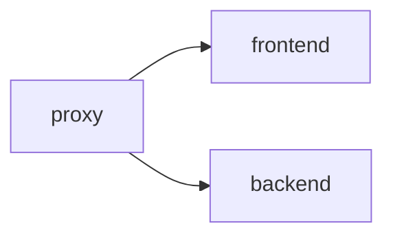

# nginx-reverse-proxy

## Basic認証用のリバースプロキシ
- frotnendとbackendを同一のNginxでBasic認証とreverse proxyをする



```bash
docker run -d --name web dockercloud/hello-world
docker run -d --name api json-server
docker run -d -p 8088:80 \
  --link web:web \
  --link api:api \
  -e FORWARD_HOST=web \
  -e FORWARD_PORT=80 \
  -e FORWARD_API_HOST=api \
  -e FORWARD_API_PORT=3000 \
  --name auth-nginx-multi \
  nginx-basic-auth-proxy

# test
curl -u foo:bar http://localhost:8088/
curl -u foo:bar http://localhost:8088/api/posts

```

